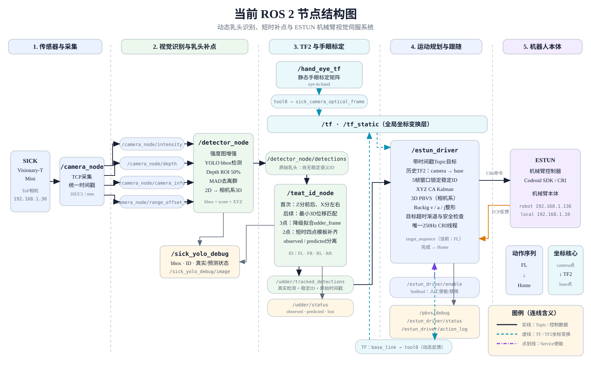

# cow_spray_ws

基于 ROS 2 Humble 的奶牛乳头视觉识别与 ESTUN 机械臂视觉伺服系统。系统使用 SICK Visionary-T Mini 获取强度图和深度图，经 YOLO、ROI 深度定位、乳头语义 ID 跟踪与短时补点后，将带时间戳的目标送入 3D PBVS 控制器，并在唯一的 250 Hz CRI 线程中完成 Ruckig 运动整形和机械臂控制。

> 本项目会连接真实工业机械臂。首次运行、修改手眼标定、工作空间、目标偏移或速度参数后，必须先使用 `dry_run` 和低速配置验证，并确保急停可用。

分模块调试和生产放行步骤见 [docs/test_sop.md](./docs/test_sop.md)。

## 系统结构



图中连线含义：

- 黑色实线：ROS Topic、相机数据或 CRI 控制数据。
- 青色虚线：TF/TF2 坐标变换；眼在手上模式必须使用图像采集时间戳查询历史 TF。
- 紫色点划线：人工使能 Service。
- `observed` 表示当前帧真实检测；`predicted` 表示利用已建立的四点模板进行的短时补点，预测点不会伪装成新的 YOLO 测量。

## 工作流程

```text
SICK 强度图 + 深度图
        ├─ ToF牛腿分割 → 双腿内缘/间距/入场中心 → 稳定窗口 → 入场许可
        ↓ 同时间戳同步
YOLO 乳头 bbox
        ↓ ROI 深度中位数 + 相机内参投影
相机坐标系三维乳头点
        ↓ ID绑定、刚体拟合、短时补点
/udder/tracked_detections
        ↓ 图像时间戳对应的历史 TF2
目标坐标 / PBVS误差
        ↓ CA Kalman + freshness + Ruckig
唯一 250 Hz CRI线程
        ↓
ESTUN机械臂
```

## 功能包

| 功能包 | 用途 |
|---|---|
| `camera` | SICK SDK封装、TCP采集、强度图、深度图、相机内参和距离偏置 |
| `teat_detection` | YOLO推理、ROI深度处理、2D→3D、乳头ID、补点状态和调试画面 |
| `arm` | 历史TF2、目标管理、CA Kalman、3D PBVS、Ruckig、CRI及安全检查 |
| `robot_description` | 眼在手上/眼在手外手眼标定参数和TF发布 |
| `cow_bringup` | 相机、视觉、TF与机械臂的统一启动入口 |
| `cow_interfaces` | 项目自定义消息定义；牛腿入场使用 `EntryStatus`，乳头链继续使用 `vision_msgs` |

## 核心节点与接口

| 节点 | 主要输入 | 主要输出 |
|---|---|---|
| `/camera_node` | SICK TCP数据流 | `/camera_node/intensity`、`depth`、`camera_info`、`range_offset_mm` |
| `/detector_node` | 强度图、深度图、相机内参 | `/detector_node/detections` |
| `/teat_id_node` | 原始检测结果 | `/udder/tracked_detections`、`/udder/status`、`udder_frame` |
| `/leg_entry_node` | 深度图、内参、历史TF | `/entry/status`（双腿内缘、间距、中心、速度、许可） |
| `/sick_yolo_debug` | 图像、深度、原始/跟踪检测、入口状态 | 独立乳头图、独立牛腿图、可选综合图 |
| `/hand_eye_tf` | `hand_eye.yaml` | `tool0 → sick_camera_optical_frame` 静态TF |
| `/estun_driver` | 跟踪目标、TF2、CRI反馈 | 250 Hz CRI命令、`base_link → tool0`、状态与调试话题 |

控制与诊断接口：

```text
/estun_driver/enable       SetBool，使能或停止动作
/estun_driver/status       当前目标、序列阶段和安全状态
/estun_driver/action_log   到达、切点和回位事件
/pbvs/debug                PBVS误差、期望速度、Ruckig输出和命令位置
/teat_detection/debug_image  乳头bbox、语义ID和预测状态
/leg_entry/debug_image       牛腿内侧点、间距、速度和入场原因
/sick_yolo_debug/image       乳头与牛腿综合叠加画面（兼容输出）
/entry/status              牛腿入场测量、稳定性、间距与产线速度
/entry/detection_enabled   一轮动作前启用、乳头接管后关闭牛腿检测
/sprayer/command           逻辑喷洒命令；默认disabled并保持false
/estun_driver/recover      故障锁存确认；不代替控制器人工复位
```

## 牛腿入场与七秒门控

`leg_entry_node` 只使用深度图下部ROI，要求检测到两个互相独立、近似竖直的连通域；单腿、粘连目标或数量异常都不会放行。节点读取两条腿的内缘深度，投影到三维并使用采集时间戳查询历史TF，随后在短窗口内验证中心位置和腿间距是否稳定。

一轮动作采用明确的单向状态流：

```text
WAIT_ENTRY →（可选）LEG_PRETRACK → TEAT_WORK → RETURNING → COMPLETE
                    任意报警/急停/碰撞 → FAULT_LATCHED
```

- `corridor_clear` 只有在 `leg_gap_min_m`/`leg_gap_max_m` 已现场标定且间距合格时才为真。
- 入场门控同时检查机械臂状态、数据新鲜度、置信度、乳头ID锁定和剩余作业时间。
- 乳头接管后发布 `/entry/detection_enabled=false`，本轮不再因牛腿离开画面而改变动作。
- 超过 `cycle_time_limit_s` 会关闭喷洒许可并受控回位。
- 可选牛腿预跟随默认关闭；必须先标定 `desired_entry_center_cam` 并低速验证。

首次启用顺序：先标定 `leg_gap_min_m`、`leg_gap_max_m`、`production_axis` 和 `entry_work_window_exit_m`，使用 `dry_run` 观察 `/entry/status`，最后才将 `require_entry_gate` 改为 `true`。不要在 `leg_gap_min_m: 0.0` 时强行绕过门控。

## 视觉识别

1. 强度图使用 1%～99% 分位数拉伸为 8 位三通道图像。
2. YOLO检测乳头 bbox；当前生产配置为 `imgsz=256`、`confidence=0.50`、`iou=0.45`。
3. 每个 bbox 只读取中央 50% ROI，过滤无效深度并使用 MAD 剔除前景/背景离群值。
4. 根据实时 `CameraInfo` 和 `range_offset_mm` 将有效像素投影为相机光学坐标系三维点。
5. 输出保留原始采集时间戳，供眼在手上的历史TF2查询使用。

主要配置：[src/teat_detection/config/detection.yaml](src/teat_detection/config/detection.yaml)。

## 乳头ID与补点

YOLO只判断“是否为乳头”，`teat_id_node` 再绑定四个语义ID：

```text
teat_front_left   teat_front_right
teat_rear_left    teat_rear_right
```

| 可见点数量 | 当前处理 |
|---:|---|
| 4 | 根据相机系 Z/X 完成首次前后左右绑定，建立完整四点局部模板 |
| 3 | 最大Z间隙分前后排，完成三点ID和 `udder_frame` 降级拟合；当前不生成第4个点 |
| 2 | 已有完整模板且未超时才允许补点；根据两点变化估计旋转和平移并恢复另外两点 |
| 0～1 | 最多匹配已有ID，不重建完整乳房位姿 |

后续帧通过全排列最小三维位移保持ID，并使用加权Kabsch拟合乳房刚体运动。连续匹配失败后进入重新捕获，避免错误ID立即进入控制链。

真实检测结果通过 `/udder/tracked_detections` 发布；补点坐标和来源记录在 `/udder/status` 的 `predicted_points`、`observed`、`predicted` 和 `lost` 字段中。

## 运动跟随

`estun_driver` 的执行链如下：

1. 使用检测消息原始时间戳查询 `camera → base_link` 历史TF2。
2. 在短窗口中确认ID结构稳定，再锁定本轮目标。
3. 对XYZ分别使用恒加速度 Kalman 模型估计位置、速度和加速度。
4. 在相机坐标系计算3D PBVS误差，并转换为机械臂基坐标系速度。
5. 使用 Ruckig 对速度、加速度和冲击进行在线约束。
6. 在唯一的250 Hz CRI线程中读取反馈、生成命令并调用 Codroid SDK。
7. 目标超时、工作空间越界、命令跟随误差、报警、急停或CRI反馈超时都会触发减速或停止。

当前动作目标只由 `target_sequence` 列表控制：

```yaml
target_sequence: ["teat_front_left"]
target_offsets: [-0.80, 0.0, -0.20]
```

四点动作示例：

```yaml
target_sequence: ["teat_front_left", "teat_rear_left", "teat_rear_right", "teat_front_right"]
target_offsets: [-0.80, 0.0, -0.20,
                 -0.80, 0.0, -0.20,
                 -0.80, 0.0, -0.20,
                 -0.80, 0.0, -0.20]
```

`target_offsets` 必须严格包含 `3 × 目标数量` 个值，单位为米、坐标系为 `base_link`。

主要配置：[src/arm/config/estun_driver.yaml](src/arm/config/estun_driver.yaml)。

## TF关系

眼在手上模式的核心TF链：

```text
base_link ──动态反馈──> tool0 ──手眼标定──> sick_camera_optical_frame
```

- `base_link → tool0`：由 `estun_driver` 根据机械臂TCP反馈动态发布。
- `tool0 → sick_camera_optical_frame`：由 `robot_description` 根据手眼标定结果静态发布。
- 视觉控制必须使用图像采集时刻查询完整TF链，禁止在眼在手上模式回退到“最新TF”。

手眼标定结果位于 [src/robot_description/config/hand_eye.yaml](src/robot_description/config/hand_eye.yaml)。

## 环境要求

- Ubuntu 22.04
- ROS 2 Humble
- Python 3.10
- SICK Visionary-T Mini及本仓库内SDK封装
- PyTorch、Ultralytics YOLO、NumPy、OpenCV
- `ruckig`
- Codroid Python SDK 2.1.10

请保证 ROS 2 节点运行使用的 Python 环境中同时存在 `torch`、`ultralytics`、`ruckig` 和 Codroid SDK，避免 `ros2 launch` 调用到另一个Python解释器。

## 构建

```bash
cd ~/Desktop/workspace/1/cow_spray_ws
source /opt/ros/humble/setup.bash

# 如果依赖安装在conda环境中
conda activate ros2_humble

colcon build --symlink-install
source install/setup.bash
```

## 启动

只启动相机、视觉和手眼TF，不连接机械臂：

```bash
ros2 launch cow_bringup bringup.launch.py
```

查看检测画面：

```bash
ros2 run rqt_image_view rqt_image_view /teat_detection/debug_image

# 另开一个rqt窗口查看牛腿，画面更新不再依赖YOLO消息
ros2 run rqt_image_view rqt_image_view /leg_entry/debug_image

# 可选综合叠加画面
ros2 run rqt_image_view rqt_image_view /sick_yolo_debug/image
```

连接机械臂但保持动作未使能：

```bash
ros2 launch cow_bringup bringup.launch.py start_arm:=true
```

确认画面、TF、目标坐标、工作空间、急停和机械臂状态均正常后，再使能动作：

```bash
ros2 service call /estun_driver/enable std_srvs/srv/SetBool "{data: true}"
```

停止跟随：

```bash
ros2 service call /estun_driver/enable std_srvs/srv/SetBool "{data: false}"
```

## 调试命令

```bash
# 节点与话题
ros2 node list
ros2 topic list

# 检测和补点状态
ros2 topic echo /udder/status
ros2 topic hz /udder/tracked_detections

# PBVS与动作状态
ros2 topic echo /pbvs/debug
ros2 topic echo /estun_driver/status

# 手眼和TCP坐标链
ros2 run tf2_ros tf2_echo tool0 sick_camera_optical_frame
ros2 run tf2_ros tf2_echo base_link sick_camera_optical_frame
```

## 测试

```bash
source /opt/ros/humble/setup.bash
source install/setup.bash

# 避免系统pytest插件版本冲突
PYTEST_DISABLE_PLUGIN_AUTOLOAD=1 python3 -m pytest \
  src/arm/test/test_estun_driver.py \
  src/arm/test/test_target_input.py -q

colcon test --packages-select camera teat_detection arm
colcon test-result --verbose
```

单元测试不会主动连接机械臂。不要使用 `ros2 launch ... start_arm:=true` 代替离线测试。

## 目录结构

```text
cow_spray_ws/
├── docs/
│   └── system_architecture.svg
├── src/
│   ├── camera/
│   ├── teat_detection/
│   ├── cow_interfaces/
│   ├── arm/
│   ├── robot_description/
│   └── cow_bringup/
├── build/       # 本地生成，不提交Git
├── install/     # 本地生成，不提交Git
└── log/         # 本地生成，不提交Git
```

## Git提交前检查

```bash
git status --short
```

建议 `.gitignore` 至少包含：

```gitignore
build/
install/
log/
__pycache__/
.pytest_cache/
*.pyc
```

不要提交机械臂账号密码、SSH密码、私有模型训练数据或现场网络凭据。
